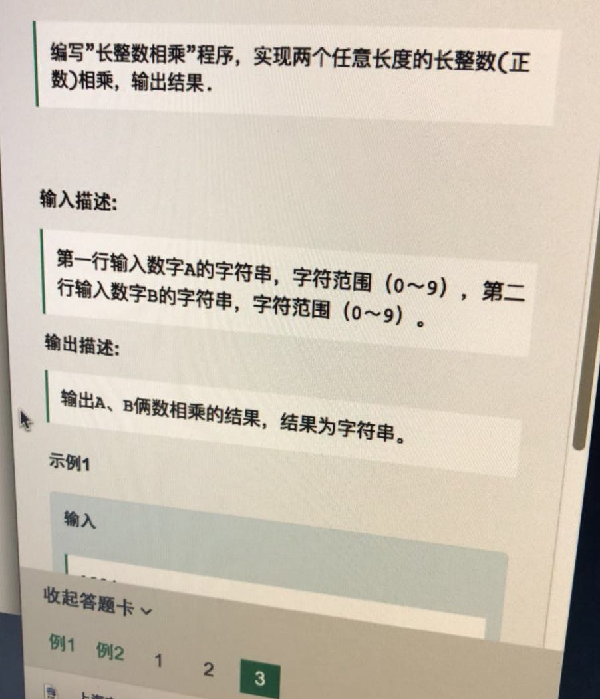
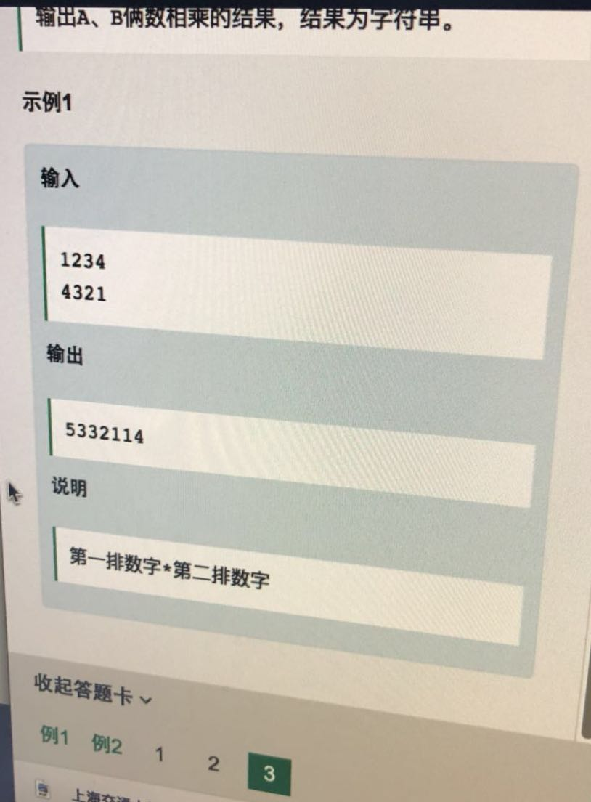

# 20180410 大数相乘





------

原理链接： https://itimetraveler.github.io/2017/08/22/%E3%80%90%E7%AE%97%E6%B3%95%E3%80%91%E5%A4%A7%E6%95%B0%E7%9B%B8%E4%B9%98%E9%97%AE%E9%A2%98%E5%8F%8A%E5%85%B6%E9%AB%98%E6%95%88%E7%AE%97%E6%B3%95/

另一个python 代码的原文链接： https://pythonandr.com/2015/10/13/karatsuba-multiplication-algorithm-python-code/

原文链接：http://lehoangvan.com/karatsuba-cpp/

This is my implementation of [Karatsuba recursive multiplication algorithm](https://en.wikipedia.org/wiki/Karatsuba_algorithm) for Stanford’s MOOC [course on algorithm design and analysis](https://www.coursera.org/learn/algorithms-divide-conquer/home/welcome). Since `C++` doesn’t support big integer arithmetics natively, I had to use `std::string`s to represent arbitrary-precision integers. The utility functions `add(string lhs, string rhs)` and `subtract(string lhs, string rhs)` implement the addition and subtraction, respectively, of large integers and the Karatsuba method is given by `multiply(string lhs, string rhs)`.

```cpp
#include <iostream>
#include <string>

#define max(a,b) ((a) > (b) ? (a) : (b))

using namespace std;

string add(string lhs, string rhs) {
    int length = max(lhs.size(), rhs.size());
    int carry = 0;
    int sum_col;  
    string result;

    while (lhs.size() < length) 
      lhs.insert(0,"0");
            
    while (rhs.size() < length) 
      rhs.insert(0,"0");

    for (int i = length-1; i >= 0; i--) {
      sum_col = (lhs[i]-'0') + (rhs[i]-'0') + carry;
      carry = sum_col/10;
      result.insert(0,to_string(sum_col % 10));
    }
    
    if (carry)
      result.insert(0,to_string(carry));
    
    return result.erase(0, min(result.find_first_not_of('0'), result.size()-1));
}

string subtract(string lhs, string rhs) {
    int length = max(lhs.size(), rhs.size());
    int diff;
    string result;

    while (lhs.size() < length) 
      lhs.insert(0,"0");
            
    while (rhs.size() < length) 
      rhs.insert(0,"0");

    for (int i = length-1; i >= 0; i--) {
        diff = (lhs[i]-'0') - (rhs[i]-'0');
        if (diff >= 0)
            result.insert(0, to_string(diff));
        else {

            int j = i - 1;
            while (j >= 0) {
                lhs[j] = ((lhs[j]-'0') - 1) % 10 + '0';
                if (lhs[j] != '9') 
                    break;
                else 
                    j--;
            }
            result.insert(0, to_string(diff+10));
        }
      
    }

    return result.erase(0, min(result.find_first_not_of('0'), result.size()-1));
}

string multiply(string lhs, string rhs) {
    int length = max(lhs.size(), rhs.size());
    
    while (lhs.size() < length) 
      lhs.insert(0,"0");

    while (rhs.size() < length) 
      rhs.insert(0,"0");

    if (length == 1)
        return to_string((lhs[0]-'0')*(rhs[0]-'0'));

    string lhs0 = lhs.substr(0,length/2);
    string lhs1 = lhs.substr(length/2,length-length/2);
    string rhs0 = rhs.substr(0,length/2);
    string rhs1 = rhs.substr(length/2,length-length/2);
    
    string p0 = multiply(lhs0,rhs0);
    string p1 = multiply(lhs1,rhs1);
    string p2 = multiply(add(lhs0,lhs1),add(rhs0,rhs1));
    string p3 = subtract(p2,add(p0,p1));

    for (int i = 0; i < 2*(length-length/2); i++)
        p0.append("0");
    for (int i = 0; i < length-length/2; i++)
        p3.append("0");
        
    string result = add(add(p0,p1),p3);

    return result.erase(0, min(result.find_first_not_of('0'), result.size()-1));
}

int main() {
    string s1, s2;
    cin >> s1 >> s2;
    cout << multiply(s1,s2) << endl;
    return 0;
}
```

