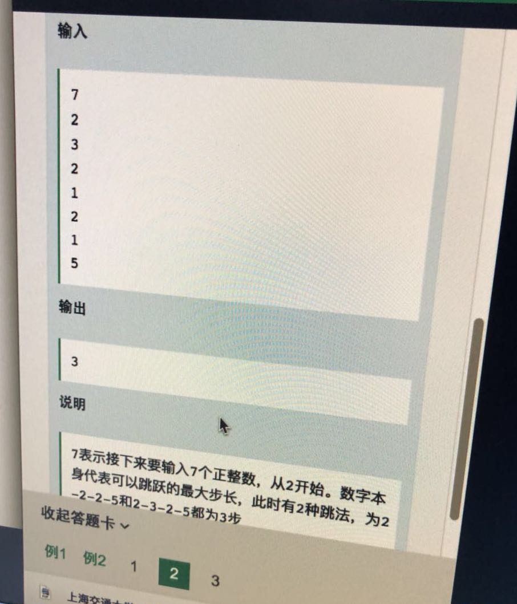
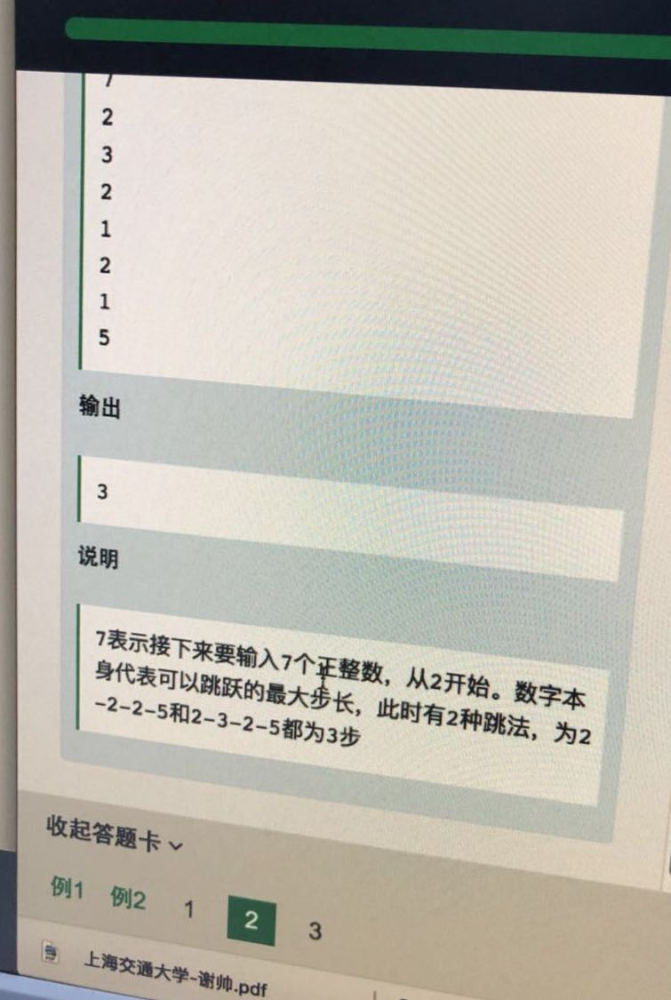

#20180410 跳一跳






这个题好像在LeetCode上见过：

```
2 3 2 1 2 1  5
|___|

例如2 最远能跳到位置2，那么找出从位置0 到能跳到最远位置内，找一个最大数，每次跳的越远越好。

比如遍历位置0： 能跳的最远 pos + 2(当前位置跳的最远) + 2(跳到pos = 2 跳的最远的地方)
假如跳到位置1： 能跳的最远 pos + 1 + 3 = pos + 4
```

上面两个情况差不多，选择跳到2.

```cpp
#include <iostream>

using namespace std;

int main(){
  int n;
  int *nums;
  cin >> n;
  nums = new int[n];
  for (int k = 0; k < n; ++k) {
    cin >> nums[k];
  }
  int i = 0;
  int count = 0;
  while (i < n) {
    int max_index = i + nums[i];
    int max_jump_len = nums[i] + nums[max_index];
    for (int j = 1; max_index < n && j < nums[i]; ++j) {
      if (j + nums[i + j] > max_jump_len) {
        max_jump_len = j + nums[i + j]; /// 更新当前能跳到的最大值
        max_index = i + j;				/// 基于当前位置的索引
      }
    }
    if (max_index != n - 1)				/// max_index 是连续遍历的，总有一个会遍历到最后的n-1
      count++;							
    i = max_index; 						/// 下一个位置的起点
  }
  cout << count;
  return 0;
}
```

