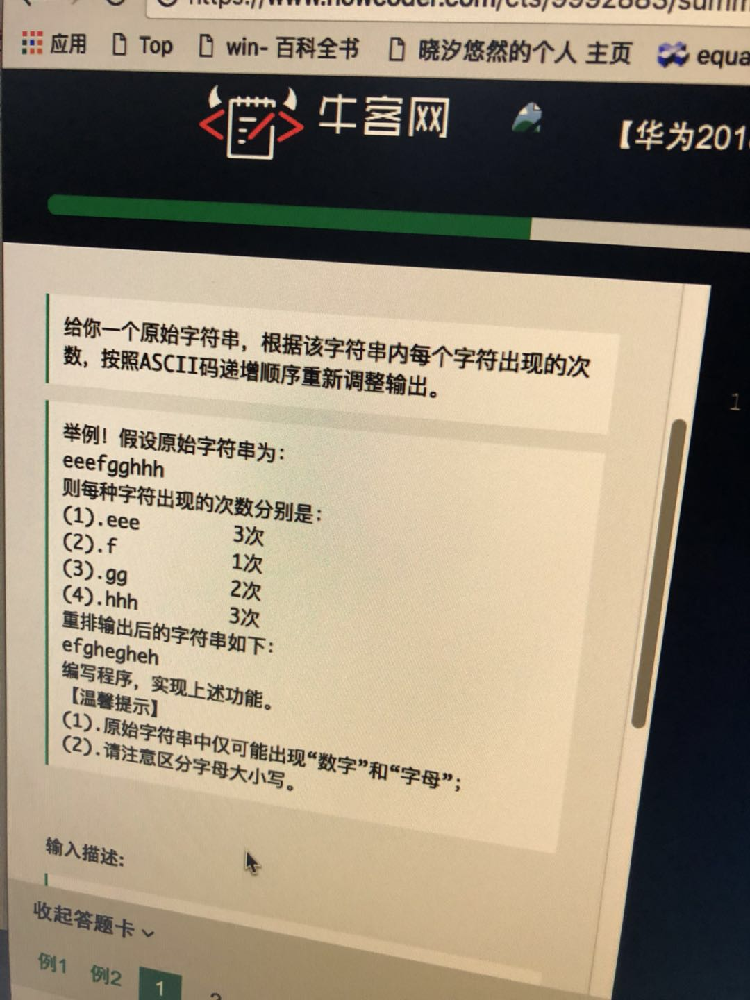
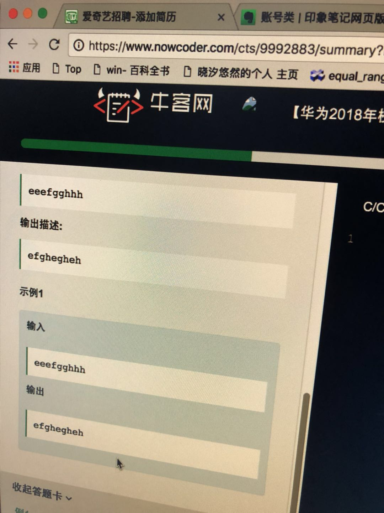

# 20180410统计ASCII 码出现的次数





主要是用一个10（10 个数字） + 26（26 个大写字母） + 26（26 个小写字母） 大小的数组来统计各个字母出现的次数

然后有的话，依次输出，并且个数-1 即可。

```cpp
#include <iostream>

using namespace std;

int main () {
  int count[10 + 26 * 2] = {0};

  string s;
  cin >> s;

  int max = 0;

  for (int i = 0; i < s.length(); ++i) {
    char c = s.at(i);
    int index = s.at(i) < 'A' ? s.at(i) - '0' : (s.at(i) < 'a' ? s.at(i) - 'A' + 10 : s.at(i) - 'a' + 36);
    count[index]++;
    max = count[index] > max ? count[index] : max;
  }

  for (int j = 0; j < max; ++j) {
    for (int i = 0; i < 62; ++i) {
      if (count[i] > 0) {
        count[i]--;
        char c = i < 10 ? i + '0' : (i < 36 ? i - 10 + 'A' : i - 36 + 'a');
        cout << c;
      }
    }
  }
  return 0;
}
```

