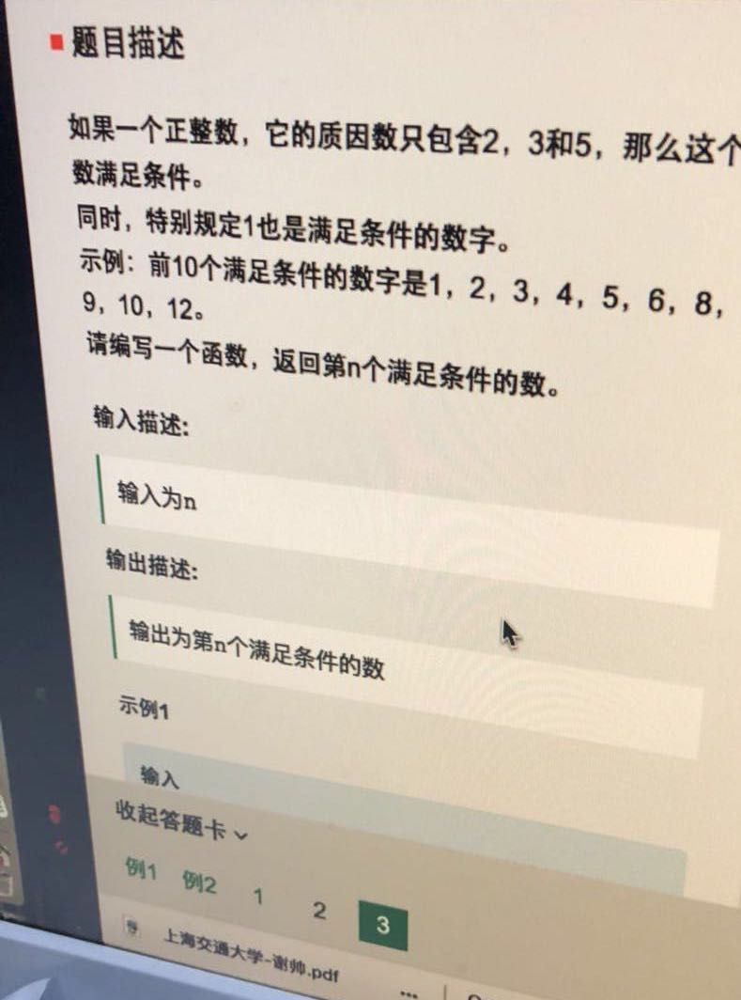

# 20180410 求满足给定素数的丑数




可以参考下面这个：

### [求质因数只能是2,3,5,7的第n大个数（丑数求解）](http://dsqiu.iteye.com/blog/1576120)

题目：求质因数只能是2,3,5,7的第n大个数。例如：1,2,3,4,5,6,7,8,910,12,14,15,16,18

​	方法一：循环判断每一个数（自然数序列）是否符合丑数的定义，直至第n个数。还有一种思想就是分别求出2,3,5,7指数的范围，然后用多重循环产生每一个数，然后进行排序。

​	方法二：使用优先队列的方法：每次出最小的一个数，并将这个数分别乘以2,3,5,7的四个数入队，直到出了n个数为止。

​	方法三：使用四叉树，根节点是1，三个子节点是2,3,5,7，代表对应边的权值，每个子节点又有三个子节点2,3,5,7。如果用完全三叉树，会出现重复路径，比如1->3->2,和1->2->3,实际上是重复的，为了去除重复，对三叉树加上限制条件：2号节点后3个子节点（2,3,5）；3号节点有2个子节点（3,5）；5号节点有一个子节点（5）。这样就不会出先重复路径了。然后在用Dijkstra算法访问这棵四叉树，当访问完n个节点时就得到了最终结果。

​	方法四：每一个数都是前面某些数乘以2,3,5,7中最小的一个，用数组存储n个数，然后在用四个指针（数组小标）分别记录当前乘以2,3,5,7数（某些数）的位置，起始的时候指针值都为1，根据当前数的大小修改四个指针的大小，如当前数是20，那么2的指针一定是指向12,3的指针指向7,5的指针指向5,7的指针指向3，然后在利用四个指针计算下一个数，取12*2,7*3,5*5,3*7中最小的一个，最后在根据当前的数的大小，修改相应的指针（每次只需要增加一个指针就行了）。

这个题就是用优先队列来解决，首先放1， 然后1 * 2， 1* 3， 1*5 ，如果不在优先队列中（用unordered_map 来去重），就放进去，每次优先队列都会按照从大到小排序，弹出最小的，把最小的 `x2，x3，x5`  放进去就可以了。

```cpp
#include <iostream>
#include <queue>
#include <unordered_map>
using namespace std;

int main() {
    priority_queue<long long int, vector<long long int>, greater<long long int>> q;
    unordered_map<long long int, int> ht;
    int n;

    cin >> n;

    q.push(1);

    long long int val = 0;
    for (int i = 0; i < n; ++i) {
        val = q.top();
        q.pop();
        if (ht.count(val * 2) == 0) {
            q.push(val * 2);
            ht[val * 2] = 1;
        }
        if (ht.count(val * 3) == 0) {
            q.push(val * 3);
            ht[val * 3] = 1;
        }
        if (ht.count(val * 5) == 0) {
            q.push(val * 5);
            ht[val * 5] = 1;
        }
    }
    cout << val;
    return 0;
}
```

下面我写的这个，好像不太对。

```cpp
#include <bits/stdc++.h>
using namespace std;


int main(){
    int n;
    cin >> n;
    priority_queue <int> pq;
//    pq.push(1);
//    pq.push(2);
//    pq.push(3);
//    pq.push(5);

    unordered_set <int> ss;
    ss.insert(1);
    ss.insert(2);
    ss.insert(3);
    ss.insert(5);
    for(int i=1; i<= n; i++){
        ss.insert(1 * i);
        ss.insert(2 * i);
        ss.insert(3 * i);
        ss.insert(5 * i);
    }

    for(auto val: ss ){
        pq.push(val);
    }

    int i =0;
    while(!pq.empty()){
        int val = pq.top(); pq.pop();
        ++i;
        if( i ==n){
            cout << val << endl;
            break;
        }
    }
    return 0;
}
```


