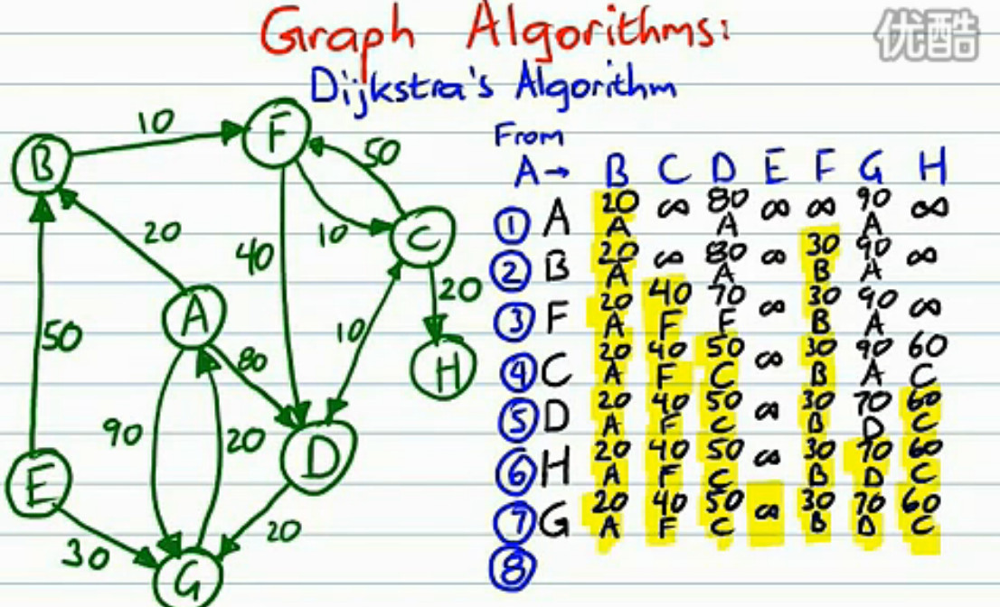
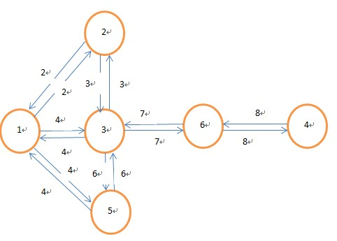
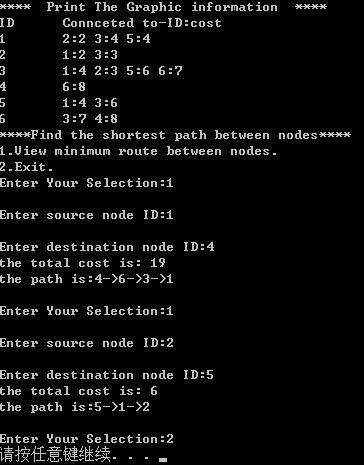

# 20180412 Dijstra 算法

首先，先找出发节点到相邻节点的距离， 然后选择一个最短的走下去。作为下一个源节点，到周围的距离重新计算，每次取较小的值。 最终，按照最短的串起来即可。

---------------------------------------

原文链接：https://www.cnblogs.com/wb-DarkHorse/archive/2013/03/12/2948467.html

一：简介

　　这个算法用于解决图中单源最短路径问题。所谓单源节点是指给定源节点，求图中其它节点到此源节点的最短路径。如下图所示：给定源节点a，求节点b到a的最短距离。

那么如何寻找？还是以上图为例：

1）初始化：设定除源节点以外的其它所有节点到源节点的距离为INFINITE(一个很大的数)，且这些节点都没被处理过。

2）从源节点出发，更新相邻节点(图中为2，3，6)到源节点的距离。然后在所有节点中选择一个最段距离的点作为当前节点。

3）标记当前节点为done(表示已经被处理过)，与步骤2类似，更新其相邻节点的距离。(这些相邻节点的距离更新也叫松弛，目的是让它们与源节点的距离最小。因为你是在当前最小距离的基础上进行更新的，由于当前节点到源节点的距离已经是最小的了，那么如果这些节点之前得到的距离比这个距离大的话，我们就更新它)。

4）步骤3做完以后，设置这个当前节点已被done，然后寻找下一个具有最小代价(cost)的点，作为新的当前节点，重复步骤3.

5)如果最后检测到目标节点时，其周围所有的节点都已被处理，那么目标节点与源节点的距离就是最小距离了。如果想看这个最小距离所经过的路径，可以回溯，前提是你在步骤3里面加入了当前节点的最优路径前驱节点信息。


算法的视频来源： http://v.youku.com/v_show/id_XMjQyOTY1NDQw.html?debug=flv



二：源代码

　　直接给源代码，注释很清楚，不解释。【**代码在unmd 文件夹**】

```c
Dijkstra.h
#ifndef _DIJKSTRA_H
#define _DIJKSTRA_H

#define MAX_VERTEX_NUM 100                        //最大顶点数
#define MAX_EDGE_NUM 50                            //相邻最大节点数
#define INFINITE 1E5                            //表示节点之间无连接的一个较大的数
#define MAX_STRLEN 256                            //最大字符串字节数

#define FALSE                        0
#define TRUE                        1
typedef int                            BOOL;
typedef unsigned int                UINT;

#define SAFEFREE(p) {if(NULL!=(p)) free(p);}

extern int g_node_num;                            //一个图中，实际节点数的全局变量
typedef struct _vertex {                        //通用的顶点数据结构体
    int id;//id
    struct _vertex *pLinkList[MAX_EDGE_NUM];    //相邻顶点的指针数组
    int nCost[MAX_VERTEX_NUM];                    //与相邻顶点的权重数组
    struct _vertex **next;                        //与剩余顶点之间的最短路径
    int *pmincost;                                //与剩余顶点之间的最小代价
}vertex;

typedef struct _node {                            //组成图的顶点元素信息进行封装
    int nID;
    struct _vertex *pVer;
}node;

BOOL InitGraphic(char path[], node arr[], UINT nsize);
void UnitGraphic(node arr[]);
void ViewGraphic(node arr[]);
BOOL Dijkstra(node arr[]);
void MinRoute(node arr[], UINT nSrID, UINT nDsID);

#endif
```

```c
Dijkstra.c
#include <stdio.h>
#include <stdlib.h>
#include <string.h>
#include "Dijkstra.h"

int g_node_num;/*用于计算实际节点数的全局变量*/
/****************************************
*函数名：InitGraphic
*参数：path-图的信息文件路径；arr-储存图的数组；nsize-数组大小
*返回值：BOOL-成功返回1，错误返回0
*说明：根据图的信息文件，初始化数组
*****************************************/
BOOL InitGraphic(char path[], node arr[], UINT nsize)
{
    char buf[MAX_STRLEN];
    char *pos;
    char ctemp;
    int ncost;
    int i;
    UINT nid;//临时顶点ID
    UINT ncid;//临时连接顶点的ID
    UINT nlinkpos;//连接顶点数组中的位置

    memset(arr, 0, sizeof(node)*nsize);//赋值0
    FILE *pfile = fopen(path, "r");
    if(NULL == pfile) {
        printf("Error opening file.\n");
        return FALSE;
    }
    while(NULL != fgets(buf, MAX_STRLEN, pfile)) {
        pos = strtok(buf, ":");//读取一行，解析第一个冒号之前的标号，即第几个节点
        nid = atoi(pos);
        if(nid < nsize) {
            arr[nid-1].nID = nid;
            arr[nid-1].pVer = (vertex*)malloc(sizeof(vertex));//申请一个顶点struct
            if(NULL == arr[nid-1].pVer) {
                printf("out of memory!\n");
                return FALSE;
            }
            memset(arr[nid-1].pVer, 0, sizeof(vertex));//赋值0
            arr[nid-1].pVer->id = nid;
            g_node_num++;//节点数加1
        } else {
            fprintf(stderr, "access the boundary of setting:%d\n", nid);
        }
    }
    rewind(pfile);//文件指针跳转到开始处，读取各顶点的相邻节点
    for(i=0; i<g_node_num; i++) {
        fscanf(pfile, "%d", &nid);//读取第一个节点标号
        nlinkpos = 0;//指示其相邻节点结构体的当前位置
        while((ctemp=fgetc(pfile)) != ';') {
            fscanf(pfile, "%u-%d", &ncid, &ncost);
            if(ncid > nsize || ncost < 0) {
                fprintf(stderr, "access the boundary of setting or find negative cost:%u-%d\n", ncid, ncost);
                return FALSE;
            }

            arr[nid-1].pVer->pLinkList[nlinkpos] = arr[ncid-1].pVer;/*相邻节点指针数组赋值*/
            arr[nid-1].pVer->nCost[ncid-1] = ncost;/*此节点到相邻节点的cost*/
            arr[nid-1].pVer->pmincost = NULL;
            arr[nid-1].pVer->next = NULL;
            nlinkpos++;
        }
    }
    fclose(pfile);
    return TRUE;
}
/*******************************************
*函数名：ViewGraphic
*参数：arr-图的数组
*返回值：无
*说明：打印图的结构信息
*******************************************/
void ViewGraphic(node arr[])
{
    int i, j;
    int nidtemp;//临时节点序号
    printf("\nID\tConnceted to-ID:cost");
    for(i=0; i<g_node_num; i++) {
        printf("\n%d\t",arr[i].nID);
        for(j=0; arr[i].pVer->pLinkList[j] != NULL; j++) {
            nidtemp = arr[i].pVer->pLinkList[j]->id;
            printf("%d:", nidtemp);
            printf("%d ",arr[i].pVer->nCost[nidtemp-1]);
        }
    }
}
/*************************************************
*函数名：Dijkstra
*参数：arr-图的数组
*返回值：TRUE-成功；FALSE-失败
*说明：依次将每个节点作为起始节点，计算剩余节点与其之间的最短路径
*************************************************/
BOOL Dijkstra(node arr[])
{
    UINT i, j, k;
    vertex *pbegin, *ptemp, *ptemp1;
    int *tcost;//用于储存其余节点到起始节点的最小代价
    BOOL *pbDone;//用于判断节点是否计算完毕的数组
    int nidtemp;//与当前节点相邻的其它节点中，cost最小的顶点序号
    int nmixcost = INFINITE;

    tcost = (int*)malloc(g_node_num * sizeof(int));
    pbDone = (BOOL*)malloc(g_node_num * sizeof(BOOL));
    if(NULL == tcost || NULL == pbDone) {
        printf("out of memory\n");
        return FALSE;
    }
    for(i=0; arr[i].pVer!=0; i++) {//依次将每个顶点作为起始节点
        for(j=0; j<g_node_num; j++) {//初始化数组
            tcost[j] = INFINITE;//其它节点到起始节点的代价
            pbDone[j] = 0;
        }
        pbegin = arr[i].pVer;//起始顶点
        pbegin->next = (vertex**)malloc(g_node_num * sizeof(vertex*));//储存每个顶点最优的前驱顶点的id的数组
        pbegin->pmincost = (int*)malloc(g_node_num * sizeof(int));//储存每个顶点到起始顶点的最小代价数组
        tcost[i] = 0;//初始化
        pbDone[i] = 1;
        pbegin->pmincost[i] = 0;
        ptemp = pbegin;//设定起始顶点为当前顶点

        while(1) {
            for(j=0; ptemp->pLinkList[j]!=0; j++) {//遍历当前顶点的相邻节点，更新最小代价(松弛边)
                ptemp1 = ptemp->pLinkList[j];
                if(tcost[ptemp1->id-1] > tcost[ptemp->id-1] + ptemp->nCost[ptemp1->id-1] \
                    && pbDone[ptemp1->id-1] == 0) {
                    tcost[ptemp1->id-1] = tcost[ptemp->id-1] + ptemp->nCost[ptemp1->id-1];
                    pbegin->next[ptemp1->id-1] = ptemp;//设定顶点更新后的前驱顶点
                }
            }
            nmixcost = INFINITE;
            for(j=0; j<g_node_num; j++) {//找出更新后,所有顶点中，代价最小的顶点，重新作为当前顶点。这一步可以优化。
                if(pbDone[arr[j].nID-1] != 1 && tcost[arr[j].nID-1] < nmixcost && tcost[arr[j].nID-1] != 0) {
                        nmixcost = tcost[arr[j].nID-1];
                        nidtemp = arr[j].nID;
                }
            }
            if(nmixcost == INFINITE) {//除起始顶点外的所有节点都已经被处理完毕，退出
                break;
            }
            pbegin->pmincost[nidtemp-1] = nmixcost;
            ptemp = arr[nidtemp-1].pVer;//重新设定当前顶点
            pbDone[nidtemp-1] = 1;//表示当前顶点已经被处理过了，其路径已经最短，代价最小
        }
    }
    free(pbDone);
    free(tcost);
    return TRUE;
}
/**********************************************************
*函数名：MinRoute
*参数：arr-图的数组；nSrID-起始节点序号；nDsID-目的节点序号
*返回值：无
*说明：给定图的数组，利用Dijkstra函数处理之后，根据设定的起始和终止节点序号，打印
*最短路径和最小代价。
***********************************************************/
void MinRoute(node arr[], UINT nSrID, UINT nDsID)
{
    if(nSrID<0 || nSrID>g_node_num || nDsID<0 || nDsID>g_node_num) {
        printf("Invalid node number!\n");
    }
    int nid;
    vertex *ptemp = arr[nSrID-1].pVer;
    printf("the total cost is: %d\n", ptemp->pmincost[nDsID-1]);
    printf("the path is:");
    nid = nDsID;
    printf("%d->",arr[nid-1].nID);
    while(ptemp->next[nid-1]->id != arr[nSrID-1].nID) {
        nid = ptemp->next[nid-1]->id;//回溯路径
        printf("%d->",nid);
    }
    printf("%d\n",arr[nSrID-1]);
}
/*****************************************
*函数名：UnitGraphic
*参数：arr-图的数组
*返回值：无
*说明：释放内存
*****************************************/
void UnitGraphic(node arr[])
{
    UINT i;
    for(i=0; i<g_node_num; i++) {
        if(arr[i].pVer != NULL) {
            SAFEFREE(arr[i].pVer->next);
            SAFEFREE(arr[i].pVer->pmincost);
        }
    }
}
```

```c
main.c
#include <stdio.h>
#include <stdlib.h>
#include <string.h>
#include "Dijkstra.h"

int main(int argc, char *argv[])
{
    char filepath[MAX_STRLEN];//图的信息文件
    node graphic[MAX_VERTEX_NUM] = {0};//图的数组
    int sid, did;
    int selnum; 

    if(argc < 2) {
        printf("usage:*.exe input\n");
        exit(1);
    }
    strcpy(filepath, argv[1]);
    /***********初始化图***************/
    if(!InitGraphic(filepath, graphic, MAX_VERTEX_NUM)) {
        UnitGraphic(graphic);
        exit(1);
    }
    printf("****  Print The Graphic information  ****");
    ViewGraphic(graphic);//打印图
    /************dijkstra运算***********/
    if(!Dijkstra(graphic)) {
        UnitGraphic(graphic);
        exit(1);
    }

    printf("\n****Find the shortest path between nodes****");
    printf("\n1.View minimum route between nodes.");
    printf("\n2.Exit.");
    
    for(;;) {
        printf("\nEnter Your Selection:");
        scanf("%d",&selnum);
        switch(selnum)    {
            case 1:    {
                printf("\nEnter source node ID:");
                scanf("%d",&sid);
                printf("\nEnter destination node ID:");
                scanf("%d",&did);

                MinRoute(graphic, sid, did);//打印最优路径
                break;
            }
            case 2:
                exit(1);
            default: {
                printf("\nEnter proper choice.\n");
                break;
            }
        }
    }
    UnitGraphic(graphic);
    return 0;
}
```

demo:

输入文件内容：

```
1:2-2:3-4:5-4;
2:1-2:3-3;
3:1-4:2-3:5-6:6-7;
4:6-8;
5:1-4:3-6;
6:3-7:4-8;
```

格式说明：

起始节点：连接节点1-权值：连接节点2-权值：连接节点3-权值.....

图的结构：



运行结果：



三：总结

　　Dijkstra最短路径搜索属于广度优先搜索(BFS, Breadth-First-Search)，即不断去搜索当前节点的所有相邻节点，并更新它们的cost。更新的前提是认为：当前节点是目前与起始节点之间cost最小的节点，它认为自己是最优解，要想到达目的节点，经过我这里必然错不了，接着在此基础上不断去寻找其它最优路径，运用的是一种贪婪算法的思想。但是有时候并不是最优解，典型的例子就是：最小数目找零的例子，现有10元，5元，1元的纸币，如果要找15块钱，贪婪算法的结果是-10元+5元。但是如果现在假设银行发行了12元一张的纸币(银行闲的蛋疼)，还用贪婪算法，结果是12+1+1+1(坑爹的，找这么多硬币！！)。但是实际上最优解仍然是10元+5元。所以有时候，具体问题要具体分析。另外，最优路径搜素还有带有启发性的A*搜索，双向广度优先搜索(BFS），它们比Dijkstra算法的搜索效率要高。改天再续。

　　再说一下，我的代码中，在寻找下一个当前节点时，用了全局搜索，这显然是一个很笨的方法，复杂度太高。一般的方法都是定义一个开集，一个闭集，用来存储未处理过的节点和已被处理的节点，所以我们可以用FIFO队列去优化。参考资料1。

参考资料：

1，《数据结构与算法分析-c++描述》,weiss

2，http://en.wikipedia.org/wiki/Dijkstra's_algorithm

3，http://blog.chinaunix.net/uid-20662820-id-142445.html

4，http://www.rawbytes.com/dijkstras-algorithm-in-c/


