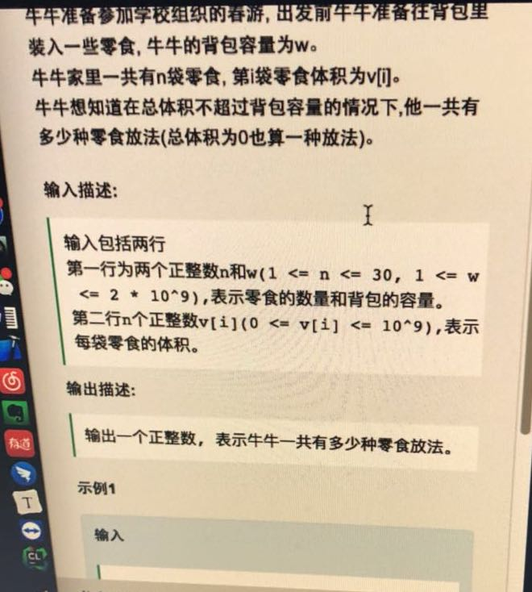
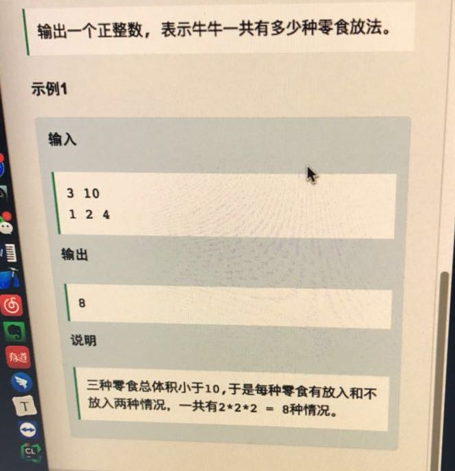
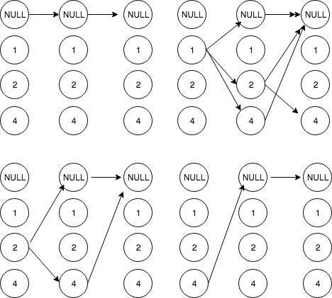
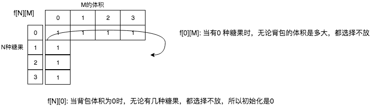

# [网易云cpp, 背包]20180327_找背包问题有多少种方法

题目如下：





对于背包问题，一般重在找递推公式.

先提供一种递归解法：

对于递归方法，我们总能描述其中的关系



```cpp
int summe(vector<int>& res){
    int sum = 0;
    for(int val: res)
        sum += val;

    return sum;
}
void backPack(int start, int m, vector<int>& A,vector<int>& res, int& gg) {
    if( summe(res) <= m )	/// 初始化res 是空的，这也是一种解法
        gg++;
    else
        return;

    for( int i=start; i< A.size(); i++ ){
        res.push_back(A[i]);
        backPack(i+1,m,A,res,gg);	//// 刚开始这里是start + 1, 这是不对的，因为到了第二个的时候，start还是0，这时候应该是递归2以后的值
        res.pop_back();
    }

}

int main(){
   vector<int> vec{1,2,4};
    vector<int> re;
    int gg = 0;
   backPack(0,10,vec,re,gg);
    cout <<gg;
    return 0;
}
```

对于背包问题，我们一般是对于n种物品，体积为w。

举个实际的例子。

```cpp
V = {1,2,4}, 三种糖果的体积，假如背包容量只有3.
请问放法有多少种。
```

定一个二维数组， `f[n][m]`, n 代表我有1~ n 种物品，至于放不放，取决于条件。 m 表示当前背包的体积。

我们有如下递推公式：

```cpp
如果第n种糖果不放，那现在的方法 f[n][m] = f[n-1][m] . 背包的体积没有变化，因为此时也没有放；
如果放了: f[n][m] = f[n-1][m - v[n]] . 因为当前已经放了v[n]的体积，所以糖果树和背包的体积都要相应的缩小。

综上： f[n][m] = f[n-1][m] + f[n-1][m- v[n]]
可以看到 f[n][m] 的值总是依赖于它上一行的结果。所以可以用一个一维数组表示。

f[m] = f[m] + f[m - v[n]]
用循环来实现：
int f[m+1];

for( int i = 0; i<= m; i++ ){
    f[i] = 1;
}

for( int i = 1; i<=n; i++ ){
    for( int j= m; j >=0; j-- ){
        if( m - v[i-1] >=0 ){		/// 当前放的下
            f[j] = f[j] + f[m-v[i-1]];
        }else					/// 一个就装满了，不放
            f[j] = f[j];
    }
}
```




使用一维数组的求解如下,注意里面的很多坑。

```cpp
#include <iostream>
#include <vector>
using namespace std;

int main()
{

    int m = 3, n = 3;
    int v[3] = {1,2,4};
    int f[m+1];

    for( int i = 0; i<= m; i++ ){
        f[i] = 1;
    }

    /// 从0 开始，因为下面v[i] 第 0 种物品的体积，是从 0 开始的
    for( int i = 0; i< n; i++ ){
        for( int j = m; j >= 0; j-- ){
            if( j - v[i] >=0 ){		        /// 一个就装满了，不放. 注意这里的变量是j，背包每次的容量是j，j 从 0 ~ m 之间依次递增求解

                /// 哦，这个值是会改变的，因为我改了前面的 f[j] 值，当后面f[j-v[i]] 可能访问到前面已经被改变的值。
                /// 数组必须逆序处理。
                f[j] = f[j] + f[j-v[i]];    /// 当前物体容积是v[i],不是v[j]， 然后依次增大背包容量。
            }else
                f[j] = f[j];
        }
    }

    cout << f[m] << endl;
    return 0;
}

>>> 
测试结果：
4
```

使用二维数组的求解情况如下：

```cpp
#include<iostream>
using namespace std;

int main(){
    int n, w;
    cin >> n >> w;
    int *v = new int[n]();

    for (int i = 0; i < n; i++)
        cin >> v[i];

    long long **dp;
    dp = new long long *[n+1]();
    for (int k = 0; k <= n; ++k) {
        dp[k] = new long long [w+1]();
    }

    for (int i = 0; i <= n; i++)
        dp[i][0] = 1;

    for (int i = 0; i <= w; i++)
        dp[0][i] = 1;

    for (int i = 0; i < n; i++)
        for (int j = 0; j <= w; j++) {
            dp[i+1][j] = dp[i][j] + dp[i][j-v[i]];	/// 还有不太对的地方，如果容量不太够？ 也就是j - v[i]  出现< 0 的情况？
        }

    cout << dp[n][w];

    delete [] v;
    delete [] dp;
    return 0;
}
```


