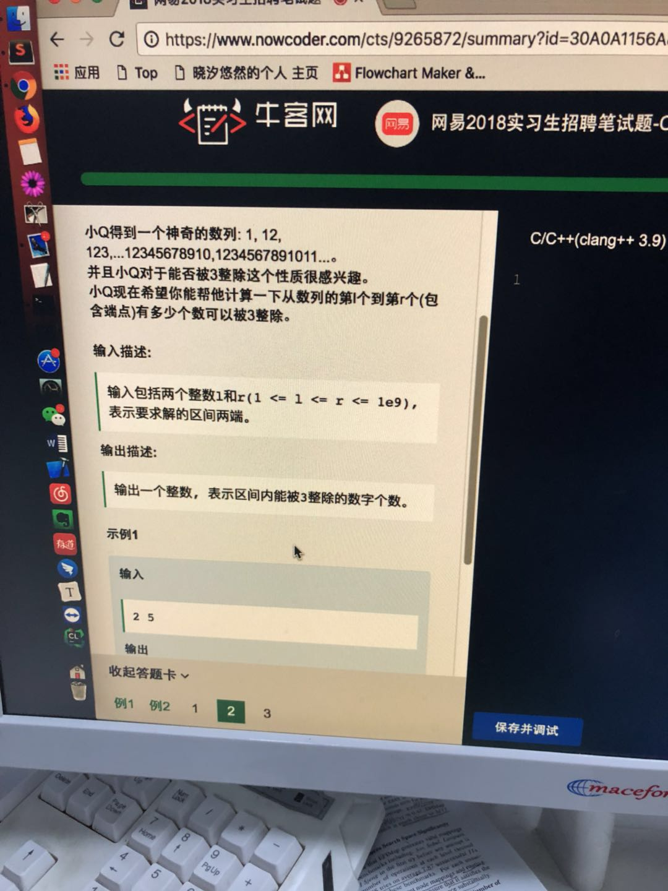

# [网易云Cpp开发，math]20180328_求被3整除的个数

题目如下： 




分析：

第一个数是： 1

第二个数是： 12

第三个数是： 123

第四个数是：1234


….

第n个数是： 1234 … n

------

判断第n个数 能否被3 整除，只需要求n的 各个数的和能否被3 整除即可。 即 (1+ 2+ 3 +  …. + n) % 3 == 0

也就是 { (n+1)n/2 }  % 3 == 0

```cpp
#include <iostream>
using namespace std;

int div_count(int l, int r) {
    int ret = 0;

    for (int j = l; j <= r; ++j) {
        int k = 1;
        long long sum =  ((long long)j + 1) * (long long)j / 2;  	/// 对 n 个数字求和
        if (sum % 3 == 0) {
            ret++;
        }
    }
    return ret;
}

int main() {
    int l, r;
    cin >> l >> r;
    cout << div_count(l, r) << endl;
    return 0;
}
```

还有一种方法，找数字规律


```python
import sys
a,b = map(int,sys.stdin.readline().split())
j = a;
j = b;

count = 0;
while( i % 3 != 1 ):
    if( i % 3 ==0 or i % 3 == 2 ):
        count += 1

    i += 1

while( j % 3 != 0 ):
    if( j%3 == 2 ):
        count += 1

    j -= 1

count += (j-i+1)/3 *2
print count
```

