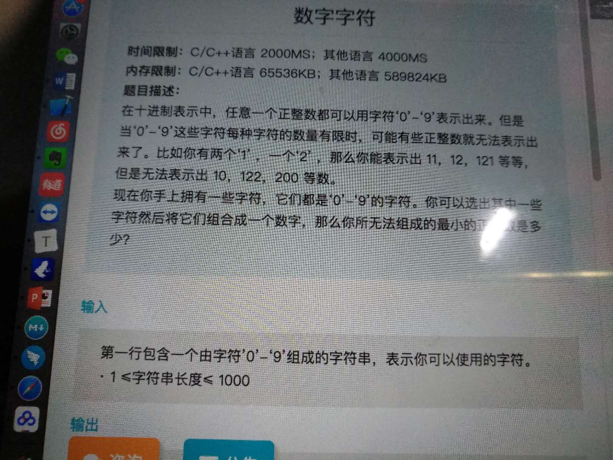

# [min_integer_math] 20180323_最小整数问题



这个题是输入'0-9'的数字，要求不能组合的最小正整数。

找出出现次数最少的数即可。但是这个题只通过了60%，有大数问题还没有解决。long long 也不行。

```
int minNum(string s) {
    int ret = 0;
    int count[10] = {0};

    for (auto ch : s) {
        count[ch - '0']++;
    }

    int min_count = INT_MAX, min_index = 0;
    for (int i = 0; i < 10; ++i) {
        if (i != 0 && count[i] == 0)
            return i;
        if (i != 0 && count[i] < min_count || i == 0 && count[i] < min_count - 1) {
            min_count = count[i];
            min_index = i;
        }
    }

    if (min_index == 0)
        ret = 1;

    while (count[min_index] > -1) {
        ret = ret * 10 + min_index;
        count[min_index]--;
    }

    return ret;

}
```

