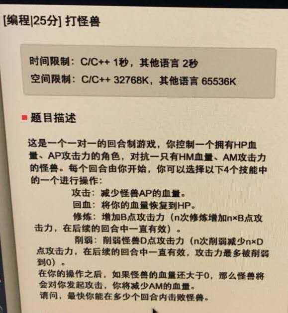
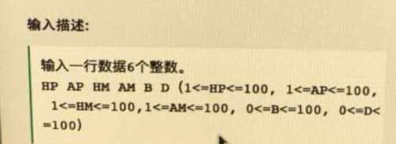
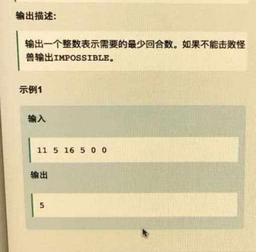

# [网易游戏人工智能，数值]20180328_打怪兽









这个题用的dfs做的，还算很经典的。


```cpp
#include <bits/stdc++.h>
using namespace std;

int init_value;
int min_value = INT_MAX;
int impossible = 0;

int tarck( int & HP, int & AP,int & HM, int& AM ){
    if( (HM - AP >0) && HP <= AM ){
        return -1;
    }

    /// 怪兽不能承受一次攻击 或者 攻击怪兽后，怪兽存货且 当前血
//    if( HM <= AP && HP >0 ||  )
    if( HM - AP >=0 )
        HM = HM - AP;
    else HM = 0;

    return 0;
}

int ret( int & HP, int & AP,int & HM, int& AM ){
    if( HP > 0 && HM >0 && (init_value > AM ) ){
        HP = init_value;
        return 0;
    }
    return -1;
}

int struggle( int & HP, int & AP,int & HM, int& AM, int& B, int& D ){
    if( HP > 0 && HM >0 && (HP > AM) ){
        AP += B;
        return 0;
    }
    return -1;
}

int decrease( int & HP, int & AP,int & HM, int& AM, int& B, int& D ){
    if( HP > 0 && HM >0 && (HP > AM - D ) ){
        AM -= D;
        return 0;
    }
    return -1;

}


void dfs( int & HP, int & AP,int & HM, int& AM, int& B, int& D, int& res ){
//    if( HM - AP > 0 && HP < AM ){
//        if( HP < (AM - D) )
//            impossible = -1 ;
//    }

    if( HP > 0 && HM <=0 ){  /// 这个地方刚开始写成 AM 去了，不太对
        if( res < min_value)
            min_value = res;

        return;
    }

    int flag = 0;
    for( int i = 0; i < 4; i ++ ) {
        if (i == 0)
            flag = tarck(HP, AP, HM, AM);
        else if (i == 1){
            if( HP < AM && HM - AP > 0 )
                flag = ret(HP, AP, HM, AM);
            else
                flag = -1;
        }

        else if (i == 2)
            flag = struggle(HP, AP, HM, AM, B, D);
        else if (i == 3)
            flag = decrease(HP, AP, HM, AM, B, D);

        if (flag != -1) {
            if( HM > 0 )
                HP = HP - AM;
            res += 1;
            dfs(HP, AP, HM, AM, B, D, res);
            res -= 1;
        }

    }

}

int main(void){
    int HP,AP,HM,AM,B,D;
    cin>> HP >> AP >> HM >> AM >> B >> D;
    init_value = HP;
    int res = 0;
    if( HM - AP > 0 && HP < AM ){
        if( HP < (AM - D) )
            impossible = -1 ;
    }

    if( impossible == -1 )
        cout << "IMPOSSIBLE" << endl;
    else{
        dfs(HP,AP,HM,AM,B,D,res);
        cout << min_value << endl;
    }

    return 0;
}
```

