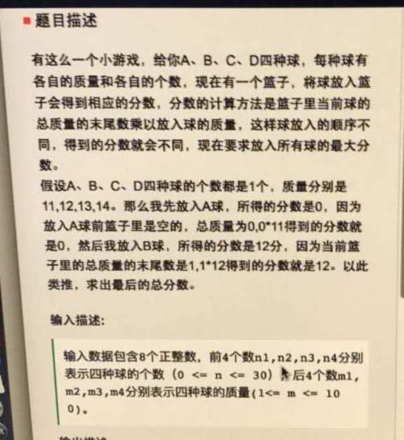
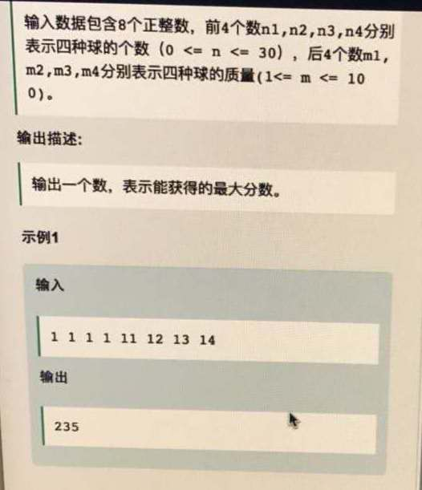

#[网易游戏雷火AI]20180328_放球游戏






这种题还是很简单的，可惜当时没有做。用dfs即可，就是怕层数深了以后，栈会放不下。

```cpp
#include <bits/stdc++.h>
using namespace std;

int max_value = INT_MIN;
void dfs(int& n1, int& n2, int& n3, int& n4,int& m1, int& m2, int& m3, int& m4, int& bucket, int& sum_socre){
    if( n1 == 0 && n2 ==0 &&n3 == 0 &&  n4 == 0 ){
        if(sum_socre > max_value)
            max_value = sum_socre;
        return;
    }

    for( int i=0; i< 4; i++ ){
        if( i == 0 && n1 > 0  ){    // 放第一种球，如果有
            int score = bucket%10 * m1;
            sum_socre += score;
            bucket += m1;
            --n1;
            dfs(n1 , n2, n3,  n4, m1,  m2,  m3,  m4,  bucket, sum_socre);
            ++n1;
            bucket -= m1;
            sum_socre -= score;
        }

        if( i == 1 && n2 > 0  ){    // 放第二种球，如果有
            int score = bucket%10 * m2;
            sum_socre += score;
            bucket += m2;
            --n2;
            dfs(n1 , n2, n3,  n4, m1,  m2,  m3,  m4,  bucket, sum_socre);
            ++n2;
            bucket -= m2;
            sum_socre -= score;
        }

        if( i == 2 && n3 > 0  ){    // 放第三种球，如果有
            int score = bucket%10 * m3;
            sum_socre += score;
            bucket += m3;
            --n3;
            dfs(n1 , n2, n3,  n4, m1,  m2,  m3,  m4,  bucket, sum_socre);
            ++n3;
            bucket -= m3;
            sum_socre -= score;
        }

        if( i == 3 && n4 > 0  ){    // 放第四种球，如果有
            int score = bucket%10 * m4;
            sum_socre += score;
            bucket += m4;
            --n4;
            dfs(n1 , n2, n3,  n4, m1,  m2,  m3,  m4,  bucket, sum_socre);
            ++n4;
            bucket -= m4;
            sum_socre -= score;
        }

    }
}


int main(){
    int n1,n2,n3,n4,m1,m2,m3,m4;        /// 分别代表四种球的个数 和 四种球的质量
    cin >> n1 >> n2 >> n3 >> n4 >> m1 >> m2 >> m3 >> m4;
    int bucket = 0;
    int sum_score = 0;
    dfs(n1, n2, n3, n4, m1, m2, m3, m4,  bucket, sum_score);
    cout << max_value << endl;
    return 0;
}

```

