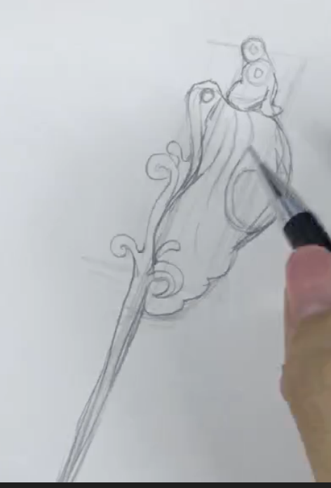

# 玉石画

绘画是一门手艺，贵在坚持。

 

## 起笔

分步解析

高光怎么突出呢？ 凸出暗部

起稿过程如下：

可塑橡皮，可以将架构擦掉。

硬橡皮不能有水，否则，容易涂黑。

## 彩描

用彩笔重新勾勒一下：

勾转折， 籫杆不是很直

准备好彩笔

流线型高光。加重后，不能画闷了。

挑绿色

右上方往左下方画， 高光要顺着结构来画。

加重点是边边角

找高光，鼓鼓的感觉表现出来。

反光，需要加重点

注意线条的虚实变化

虚实变化： 靠近高光的，周围要轻点， 转折的要注意虚实变化。（下笔有轻有重）

加重暗面， 突出高光的， 可以多试试各种颜色

要稍微重的笔，卡一下。 高光的轮廓要描一点

先找暗面

有一个渐变

接触在

杆上，加阴影，镶嵌在上面吗

上轻下重

第一遍，平涂要轻点， 后面好处理一些

转折的稍微鼓一些

平涂心

用重的笔，一层层排线

换笔，加一些轻的颜色

小明暗，要微弱一些。排线要稳一点，不要很乱。

叠加，加一些重的绿色。

边缘，也要画的重一点，卡边缘。

里面的质感，用绿色叠加

画轮廓

找小转折，排线要细腻，均匀，顺着结构变化，才能，表现出立体感和质感

调子就是线条

找转折

越是细节，越要画的细腻一些

靠近籫杆的要重点

靠近暗边的，稍微重些

不要留太多的空隙

多练习，没有捷径

工笔：是国画里的

转折，遇到光，要加厚度，因为有点点阴影

加重细节

## 画杆

高光

两层结构

转折加重点

画完后的效果

祥云

成品， 有高光的，要先加重暗部，然后，高光和暗部相互影响。

回国加的彩绘笔

