# 画多肉

形体都是各种各样的椭圆。

先找起形，找比例

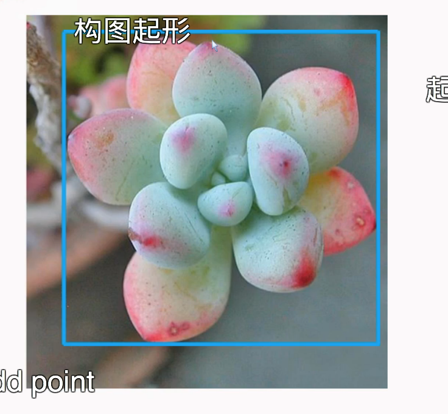

分组起形和定点起形

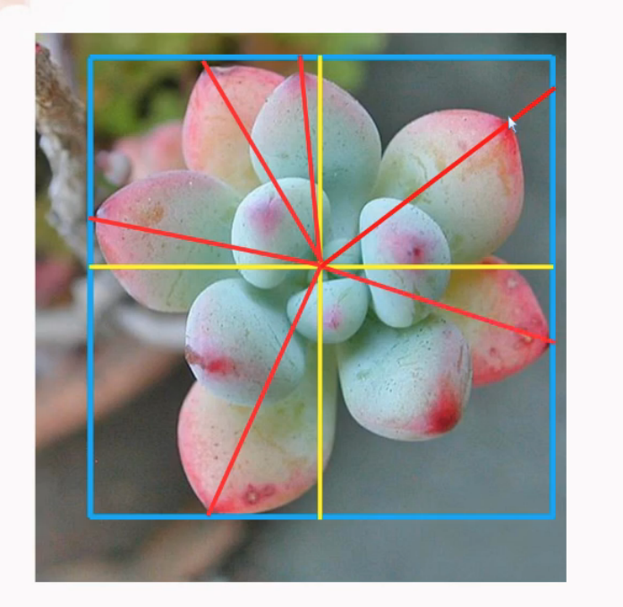

彩铅，回拨家72色的彩铅

天薄地厚，左右均匀

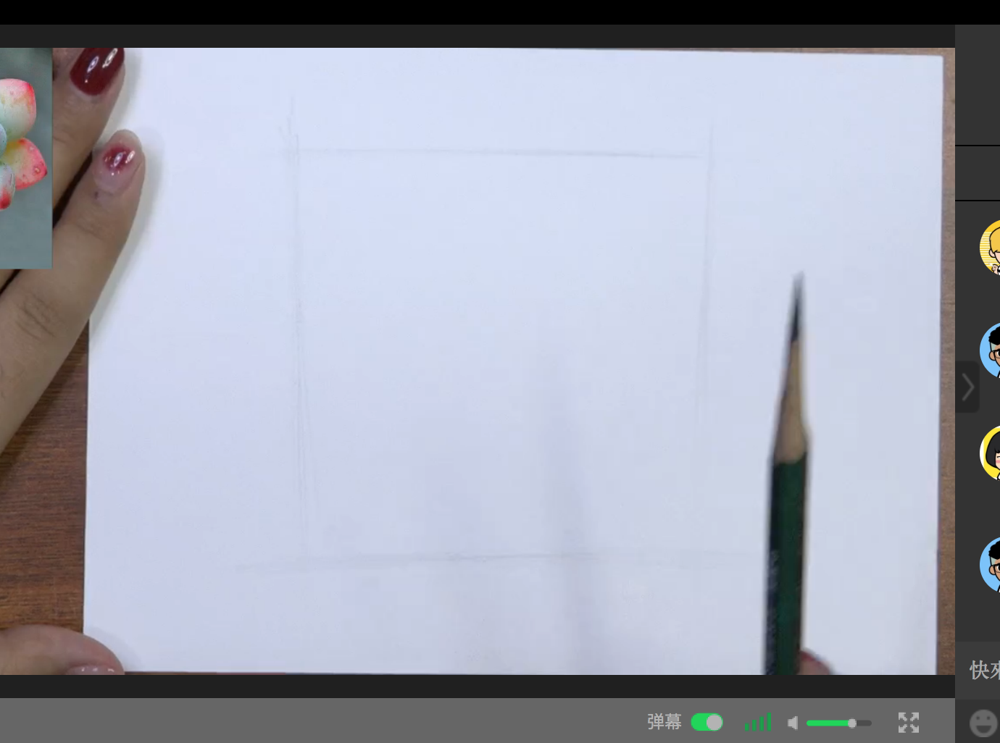

整体田字格

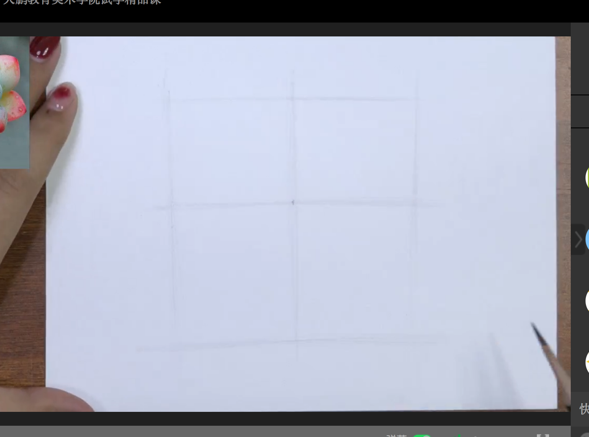

找红色边边的比例（从左下顺时针旋转）

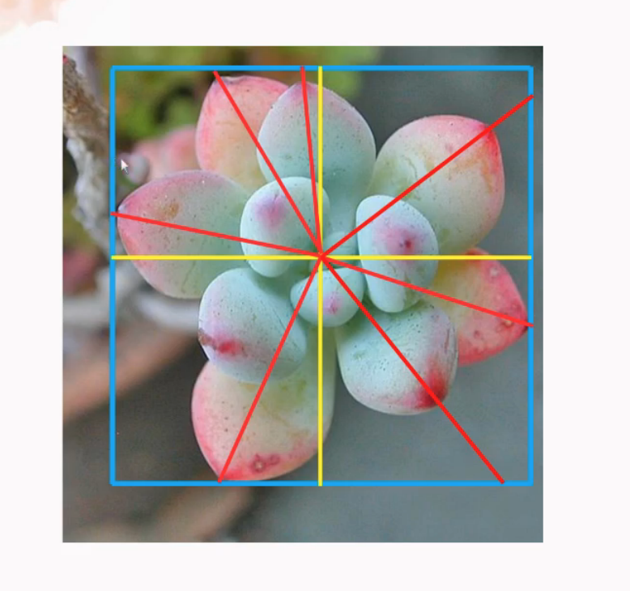

用笔轻轻的

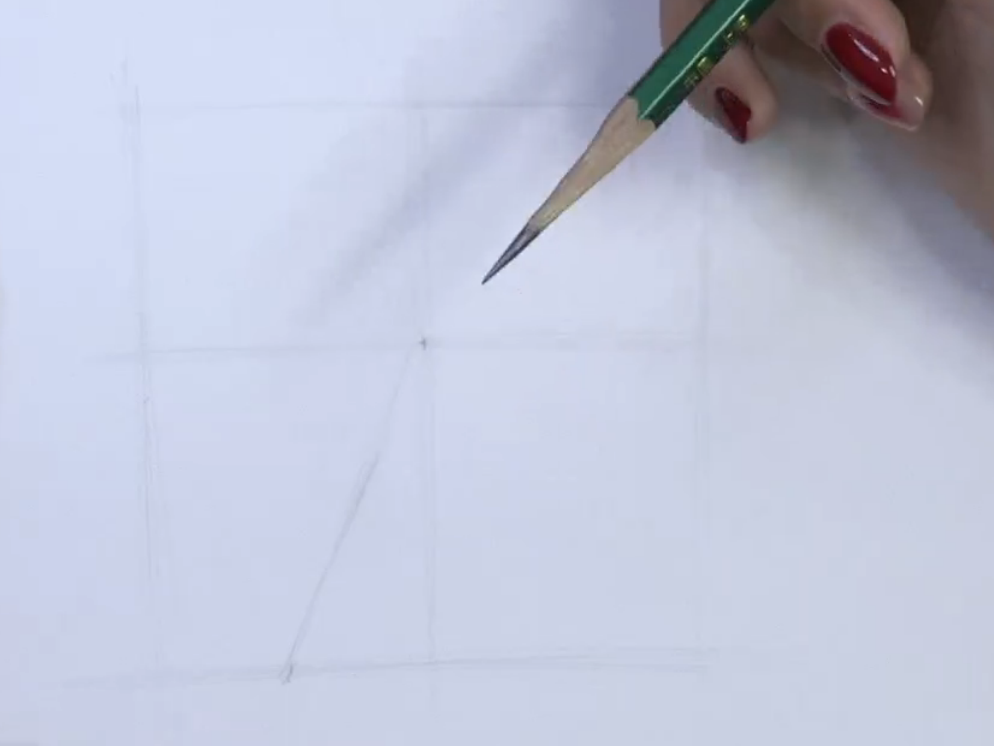

轻轻划线

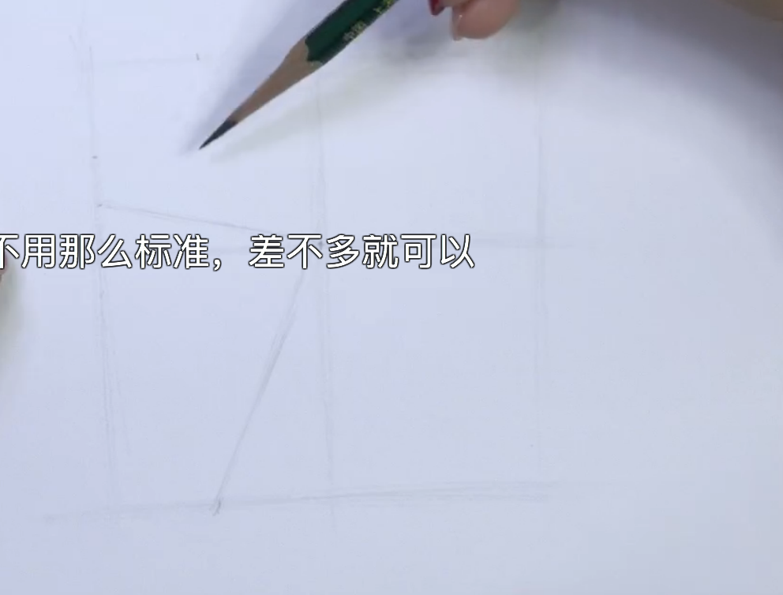

凭感觉画的，基础课以彩铅为主

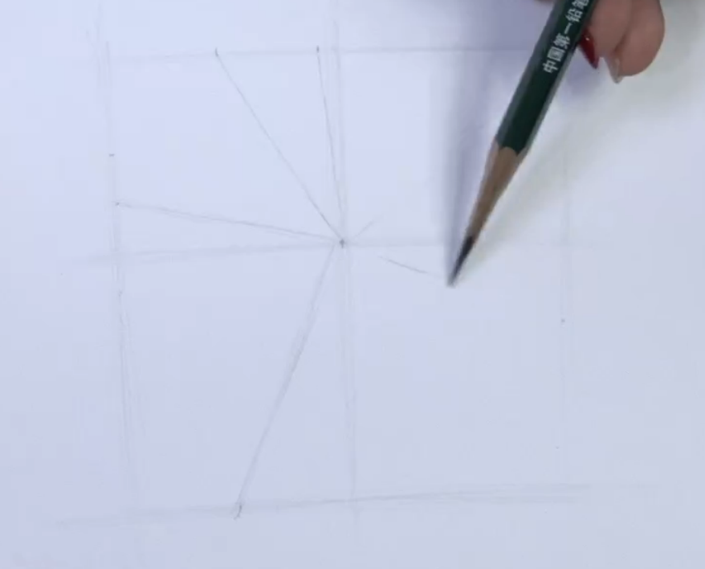

都订好了的

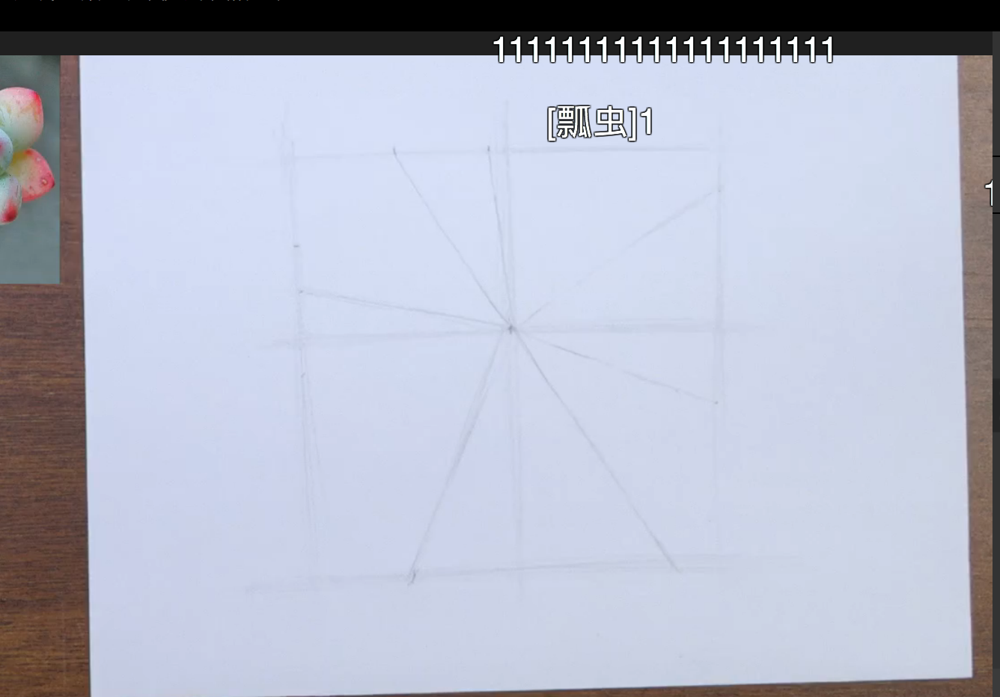

宽度，

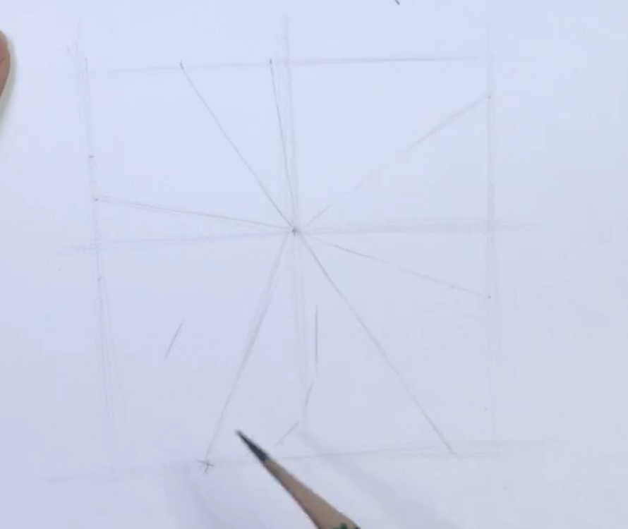

（起形是）短直线，左右画起来

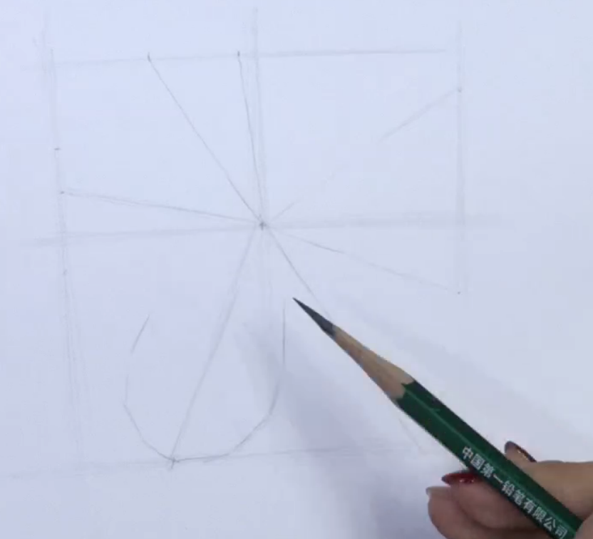

看着原图来切这个形， 能准一点就一点

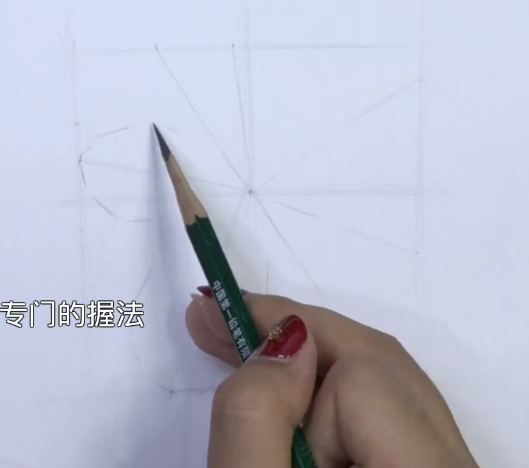

先画前面的，再画后面的

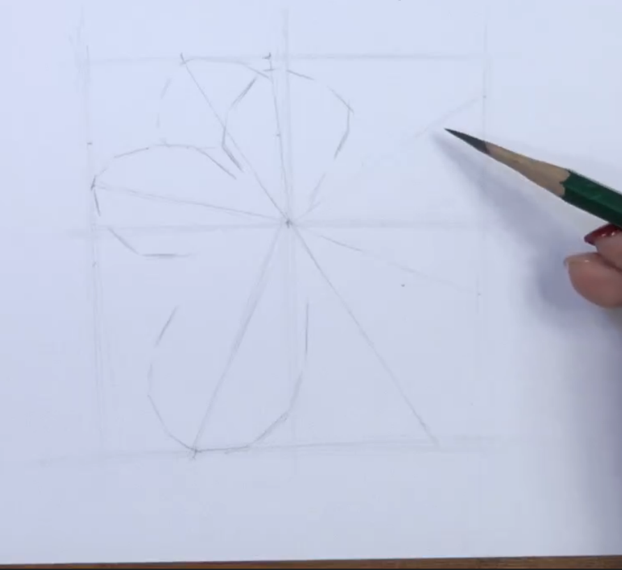

确定好形态

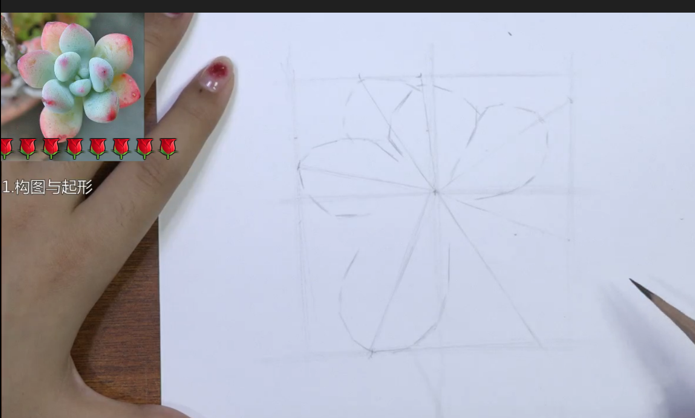

