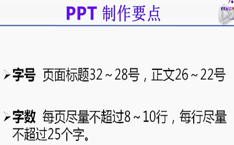
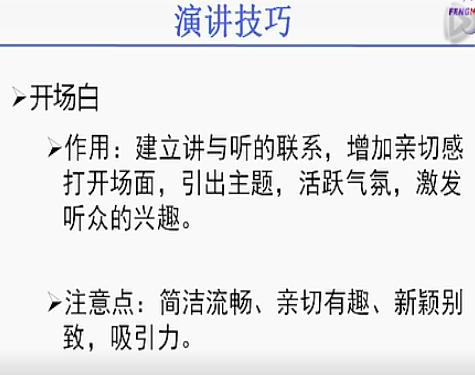

# 学术报告的一些要点

尽量保持微笑

常用语[参考](https://www.editage.cn/insights/1958.html) 

**自信的开场**：简报如何开始非常重要，你需要在开场的十秒到二十秒之间抓住观众的信心和注意力。用快速的自我介绍开头可以帮助你建立自己的可信度。一定要进行事前准备。小心选择几个要讲的点，准备一个简短的自我介绍。这里提供一个开场白范例：Good morning everybody! My name is Tom Smith. I am a post graduate in medicine from the Peking University, Beijing and I have spent the past five years working at the Department of Internal Medicine, Beijing Hospital. Today, I am going to present a paper titled ……。

**利用转换**：要记得，从一个想法到另一个想法要使用转换：转换能确保顺畅的简报流程。好用的转换词有：furthermore、in addition、consequently、meanwhile、finally 等等。如果同样的想法用了两次，可以用“A similar idea is”或“Another example is”等开头。进行逐点说明时，最好一开始先提及要点的总数，例如：There are four reasons for this. The first reason is….; the second reason is;…等。这个方式可以帮助观众知道你讨论的点进行到哪里。此外，有时候简单的暂停或是直接说“Let’s move to the next part of the presentation”、“To move on to another idea”都是进入新段落、想法或观点的有效方式。

**但字体大小至少应为 24 号** 

 