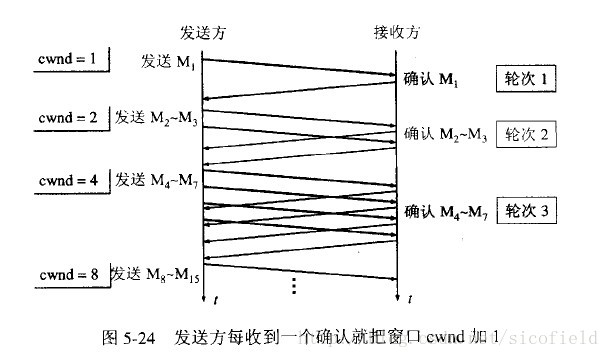
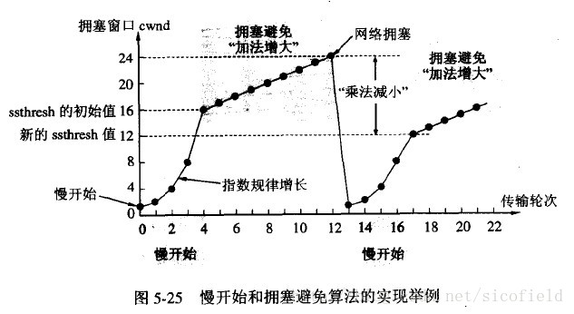
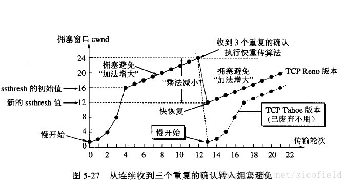
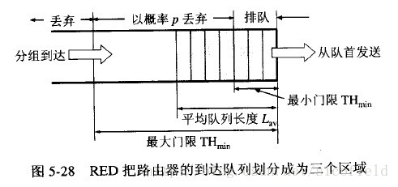
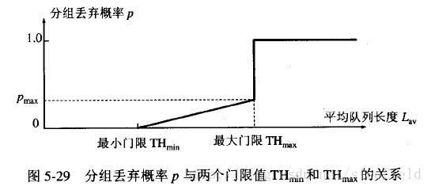
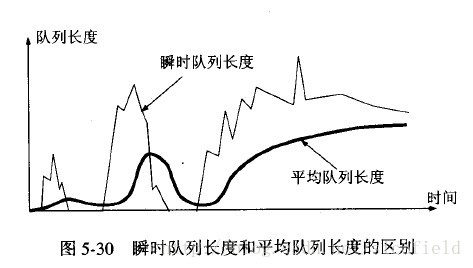

# TCP拥塞控制 慢开始 拥塞避免 快重传 快恢复

## 1.引言

​       计算机网络中的带宽、交换结点中的缓存和处理机等，都是网络的资源。在某段时间，若对网络中某一资源的需求超过了该资源所能提供的可用部分，网络的性能就会变坏。这种情况就叫做拥塞。

       拥塞控制就是防止过多的数据注入网络中，这样可以使网络中的路由器或链路不致过载。**拥塞控制是一个全局性的过程，和流量控制不同，流量控制指点对点通信量的控制。**

## 2.慢开始与拥塞避免

       发送方维持一个叫做**拥塞窗口cwnd（congestion window）**的状态变量。拥塞窗口的大小取决于网络的拥塞程度，并且动态地在变化。发送方让自己的发送窗口等于拥塞窗口，另外考虑到接受方的接收能力，发送窗口可能小于拥塞窗口。

​       慢开始算法的思路就是，不要一开始就发送大量的数据，先探测一下网络的拥塞程度，也就是说由小到大逐渐增加拥塞窗口的大小。

       这里用报文段的个数的拥塞窗口大小举例说明慢开始算法，实时拥塞窗口大小是以字节为单位的。如下图：

​       当然收到单个确认但此确认多个数据报的时候就加相应的数值。所以一次传输轮次之后拥塞窗口就加倍。这就是乘法增长，和后面的拥塞避免算法的加法增长比较。

​       为了防止cwnd增长过大引起网络拥塞，还需设置一个慢开始门限ssthresh状态变量。ssthresh的用法如下：

**当cwnd<ssthresh时，使用慢开始算法。**

**当cwnd>ssthresh时，改用拥塞避免算法。**

**当cwnd=ssthresh时，慢开始与拥塞避免算法任意。**

       拥塞避免算法让拥塞窗口缓慢增长，即每经过一个往返时间RTT就把发送方的拥塞窗口cwnd加1，而不是加倍。这样拥塞窗口按线性规律缓慢增长。

       无论是在**慢开始阶段**还是在**拥塞避免阶段**，只要发送方判断网络出现拥塞（其根据就是没有收到确认，虽然没有收到确认可能是其他原因的分组丢失，但是因为无法判定，所以都当做拥塞来处理），就把慢开始门限设置为出现拥塞时的发送窗口大小的一半。然后把拥塞窗口设置为1，执行慢开始算法。如下图：

      **再次提醒这里只是为了讨论方便而将拥塞窗口大小的单位改为数据报的个数，实际上应当是字节。**

## 3.快重传和快恢复

       快重传要求接收方在收到一个失序的报文段后就立即发出重复确认（为的是使发送方及早知道有报文段没有到达对方）而不要等到自己发送数据时捎带确认。快重传算法规定，发送方只要一连收到三个重复确认就应当立即重传对方尚未收到的报文段，而不必继续等待设置的重传计时器时间到期。如下图：

快重传配合使用的还有快恢复算法，有以下两个要点:

①当发送方连续收到三个重复确认时，就执行“乘法减小”算法，把ssthresh门限减半。但是接下去并不执行慢开始算法。

②考虑到如果网络出现拥塞的话就不会收到好几个重复的确认，所以发送方现在认为网络可能没有出现拥塞。所以此时不执行慢开始算法，而是将cwnd设置为ssthresh的大小，然后执行拥塞避免算法。如下图：

 

## 4.随机早期检测RED

       以上的拥塞避免算法并没有和网络层联系起来，实际上网络层的策略对拥塞避免算法影响最大的就是路由器的丢弃策略。在简单的情况下路由器通常按照先进先出的策略处理到来的分组。当路由器的缓存装不下分组的时候就丢弃到来的分组，这叫做尾部丢弃策略。这样就会导致分组丢失，发送方认为网络产生拥塞。更为严重的是网络中存在很多的TCP连接，这些连接中的报文段通常是复用路由路径。若发生路由器的尾部丢弃，可能影响到很多条TCP连接，**结果就是这许多的TCP连接在同一时间进入慢开始状态。这在术语中称为全局同步。全局同步会使得网络的通信量突然下降很多，而在网络恢复正常之后，其通信量又突然增大很多。**

​       为避免发生网路中的全局同步现象，路由器采用随机早期检测(RED:randomearly detection)。该算法要点如下：

​       使路由器的队列维持两个参数，即队列长队最小门限min和最大门限max，每当一个分组到达的时候，RED就计算平均队列长度。然后分情况对待到来的分组：

①平均队列长度小于最小门限——把新到达的分组放入队列排队。

②平均队列长度在最小门限与最大门限之间——则按照某一概率将分组丢弃。

③平均队列长度大于最大门限——丢弃新到达的分组。

      以概率p随机丢弃分组，让拥塞控制只在个别的TCP连接上执行，因而避免全局性的拥塞控制。

       RED的关键就是选择三个参数最小门限、最大门限、丢弃概率和计算平均队列长度。**平均队列长度采用加权平均的方法计算平均队列长度，这和往返时间（RTT）的计算策略是一样的。**

 

## 参考

[1] https://blog.csdn.net/sinat_21112393/article/details/50810053