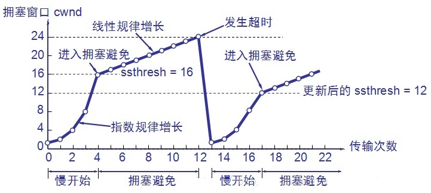
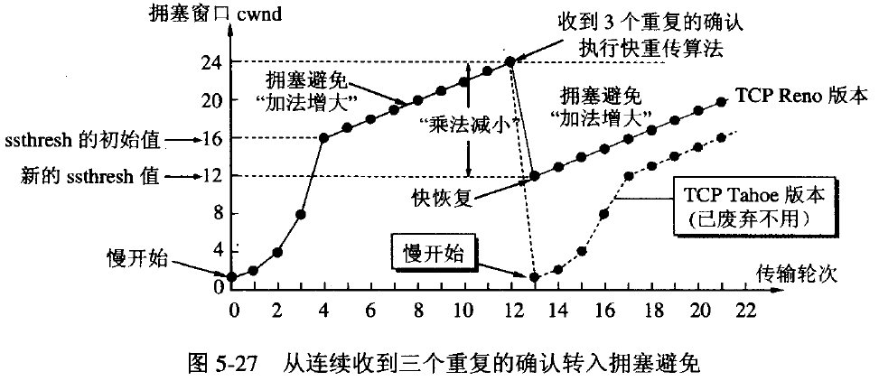

# tcp 三次握手和四次挥手

看到一篇比较的好的[文章](https://www.cnblogs.com/morethink/p/8047834.html), 摘录如下：

## 三次握手

TCP连接是通过三次握手来连接的。

**第一次握手**

当客户端向服务器发起连接请求时，客户端会发送同步序列标号`SYN`到服务器，在这里我们设`SYN`为x，等待服务器确认，这时客户端的状态为`SYN_SENT`。

**第二次握手**

当服务器收到客户端发送的`SYN`后，服务器要做的是确认客户端发送过来的`SYN`，在这里服务器发送确认包`ACK`，这里的`ACK`为x+1，意思是说“我收到了你发送的`SYN`了”，同时，服务器也会向客户端发送一个`SYN`包，这里我们设`SYN`为y。这时服务器的状态为`SYN_RECV`。

一句话，服务器端发送`SYN`和`ACK`两个包。

**第三次握手**

客户端收到服务器发送的`SYN`和`ACK`包后，需向服务器发送确认包`ACK`，“我也收到你发送的`SYN`了，我这就给你发个确认过去，然后我们即能合体了”，这里的`ACK`为y+1，发送完毕后，客户端和服务器的状态为`ESTABLISH`，即TCP连接成功。

在三次握手中，客户端和服务器端都发送两个包`SYN`和`ACK`，只不过服务器端的两个包是一次性发过来的，客户端的两个包是分两次发送的。

TCP的三次握手和四次挥手

 

## 四次挥手

当A端和B端要断开连接时，需要四次握手，这里称为四次挥手。

断开连接请求可以由客户端发出，也可以由服务器端发出，在这里我们称A端向B端请求断开连接。

**第一次挥手**

A端向B端请求断开连接时会向B端发送一个带有`FIN`标记的报文段，这里的`FIN`是`Finish`的意思。

**第二次挥手**

B端收到A发送的`FIN`后，B段现在可能现在还有数据没有传完，所以B端并不会马上向A端发送`FIN`，而是先发送一个确认序号`ACK`，意思是说“你发的断开连接请求我收到了，但是我现在还有数据没有发完，请稍等一下呗”。

**第三次挥手**

当B端的事情忙完了，那么此时B端就可以断开连接了，此时B端向A端发送`FIN`序号，意思是这次可以断开连接了。

**第四次挥手**

A端收到B端发送的`FIN`后，会向B端发送确认`ACK`，然后经过两个MSL时长后断开连接。

MSL是Maximum Segment Lifetime，最大报文段生存时间，2个MSL是报文段发送和接收的最长时间。

 

## 两次握手可以么？

TCP连接时是三次握手，那么两次握手可行吗？

在谢希仁著《计算机网络》第六版中讲"三次握手"的目的是"为了防止已失效的连接请求报文段突然又传送到了服务端，因而产生错误"。

假定出现一种异常情况下：client发出的第一个连接请求报文段并没有丢失，而是在某个网络结点长时间的滞留了，以致延误到连接释放以后的某个时间才到达server。本来这是一个早已失效的报文段。但server收到此失效的连接请求报文段后，就误认为是client再次发出的一个新的连接请求。于是就向client发出确认报文段，同意建立连接。假设不采用“三次握手”，那么只要server发出确认，新的连接就建立了。由于现在client并没有发出建立连接的请求，因此不会理睬server的确认，也不会向server发送`ACK`包。这样就会白白浪费资源。

而经过三次握手，客户端和服务器都有应有答，这样可以确保TCP正确连接。

 

## 为什么TCP连接是三次，挥手确是四次？

在TCP连接中，服务器端的`SYN`和`ACK`向客户端发送是一次性发送的，而在断开连接的过程中，B端向A端发送的`ACK`和`FIN`是是分两次发送的。因为在B端接收到A端的`FIN`后，B端可能还有数据要传输，所以先发送`ACK`，等B端处理完自己的事情后就可以发送`FIN`断开连接了。

 

## 为什么在第四次挥手后会有2个MSL的延时？

前文说到:
MSL是Maximum Segment Lifetime，最大报文段生存时间，2个MSL是报文段发送和接收的最长时间。

假定网络不可靠，那么第四次发送的`ACK`可能丢失，即B端无法收到这个`ACK`，如果B端收不到这个确认`ACK`，B端会定时向A端重复发送`FIN`，直到B端收到A的确认`ACK`。所以这个2MSL就是用来处理这个可能丢失的`ACK`的。

# TCP流量控制

一般说来，我们总是希望数据传输得更快一些。但如果发送方把数据发送得过快，接收方可能来不及接收，这就会造成数据的丢失。所谓 **流量控制(flow contrl)** 就是 **让发送方的发送速率不要太快，要让接收方来得及接收** 。

TCP利用滑动窗口机制实现对发送方的流量控制，发送方的发送窗口不可以大于接收方给出的接收窗口的大小。窗口两个边沿的相对运动增加或减少了窗口的大小。当接收方没有缓存可用，会发送零窗口大小的报文，此时发送方不能够发送任何数据。

TCP的窗口单位是字节，不是报文段。

## 滑动窗口

滑动窗口协议是传输层进行流控的一种措施，接收方通过通告发送方自己的窗口大小，从而控制发送方的发送速度，从而达到防止发送方发送速度过快而导致自己被淹没的目的。

TCP滑动窗口分为接受窗口，发送窗口。

对ACK的再认识，ack通常被理解为收到数据后给出的一个确认ACK，ACK包含两个非常重要的信息：

1. 期望接收到的下一字节的序号n，该n代表接收方已经接收到了前n-1字节数据，此时如果接收方收到第n+1字节数据而不是第n字节数据，接收方是不会发送序号为n+2的ACK的。举个例子，假如接收端收到1-1024字节，它会发送一个确认号为1025的ACK,但是接下来收到的是2049-3072，它是不会发送确认号为3072的ACK,而依旧发送1025的ACK。
2. 是当前的窗口大小m，如此发送方在接收到ACK包含的这两个数据后就可以计算出还可以发送多少字节的数据给对方，假定当前发送方已发送到第x字节，则可以发送的字节数就是y=m-(x-n).

重点：
发送方根据收到ACK当中的期望收到的下一个字节的序号n以及窗口m，还有当前已经发送的字节序号x，算出还可以发送的字节数。

滑动窗口协议如图所示：

在这个图中，我们将字节从1至11进行标号。接收方通告的窗口称为提出的窗口，它覆盖了从第4字节到第9字节的区域，表明接收方已经确认了包括第3字节在内的数据，且通告窗口大小为6。我们知道窗口大小是与确认序号相对应的。发送方计算它的可用窗口，该窗口表明多少数据可以立即被发送。当接收方确认数据后，这个滑动窗口不时地向右移动。窗口两个边沿的相对运动增加或减少了窗口的大小。我们使用三个术语来描述窗口左右边沿的运动：

- 窗口左边沿向右边沿靠近为窗口合拢。这种现象发生在数据被发送和确认时。
- 当窗口右边沿向右移动时将允许发送更多的数据，我们称之为窗口张开。这种现象发生在另一端的接收进程读取已经确认的数据并释放了T C P的接收缓存时。
- 当右边缘向左移动时，称之为窗口收缩。

每个TCP连接有发送窗口和接收窗口这两个窗口。

TCP是双工的协议，会话的双方都可以同时接收、发送数据。

TCP会话的双方都各自维护一个“发送窗口”和一个“接收窗口”。其中各自的“接收窗口”大小取决于应用、系统、硬件的限制（TCP传输速率不能大于应用的数据处理速率）。各自的“发送窗口”则要求取决于对端通告的“接收窗口”，要求相同。

 

# TCP拥塞控制

在计算机网络中的链路容量(即带宽)、交换节点中的缓存和处理机等，都是网络中的资源。在某段时间，若对网络中某一资源的需求超过了该资源所能提供的可用部分，网络的性能就会变坏。这种情况就叫做 **拥塞**。

**拥塞控制** 就是 **防止过多的数据注入网络中，这样可以使网络中的路由器或链路不致过载**。

拥塞控制是一个全局性的过程，和流量控制不同，流量控制指点对点通信量的控制。

进行拥塞控制的四种算法：

1. 慢开始（Slow-start)
2. 拥塞避免（Congestion Avoidance)
3. 快重传（Fast Restrangsmit)
4. 快恢复（Fast Recovery）。

 

## 慢开始和拥塞避免

发送方维持一个叫做拥塞窗口cwnd（congestion window）的状态变量。拥塞窗口的大小取决于网络的拥塞程度，并且动态地在变化。发送方让自己的发送窗口等于拥塞窗口，另外考虑到接受方的接收能力，发送窗口可能小于拥塞窗口。

慢开始算法的思路就是，不要一开始就发送大量的数据，先探测一下网络的拥塞程度，也就是说由小到大逐渐增加拥塞窗口的大小。在一开始发送方先设置cwnd=1，**每经过一次传输轮次之后拥塞窗口就加倍（2的指数倍增加）**。

为了防止窗口cwnd增长过大引起网络拥塞，还需设置一个慢开始门限ssthresh状态变量。ssthresh的用法如下：

- 当cwnd<ssthresh时，使用慢开始算法。
- 当cwnd>ssthresh时，改用拥塞避免算法。
- 当cwnd=ssthresh时，既可使用慢开始算法，也可使用拥塞算法。

拥塞避免算法让拥塞窗口缓慢增长，即每经过一个往返时间RTT就把发送方的拥塞窗口cwnd加1，而不是加倍。**这样拥塞窗口按线性规律缓慢增长**，比慢开始算法的拥塞窗口增长速率缓慢得多。

无论是在慢开始阶段还是在拥塞避免阶段，只要发送方判断网络出现拥塞（**其根据就是没有收到确认，虽然没有收到确认可能是其他原因的分组丢失，但是因为无法判定，所以都当做拥塞来处理**），就把慢开始门限设置为出现拥塞时的发送窗口大小的一半。然后把拥塞窗口设置为1，执行慢开始算法。

慢开始和拥塞避免

## 快重传和快恢复

快重传要求接收方在收到一个失序的报文段后就立即发出重复确认（为的是使发送方及早知道有报文段没有到达对方）而不要等到自己发送数据时捎带确认。快重传算法规定，发送方只要一连收到三个重复确认就应当立即重传对方尚未收到的报文段，而不必继续等待设置的重传计时器时间到期。由于发送方能 **尽早重传未被确认的报文段**，因此采用快重传算法后可以使整个网络的吞吐量提高约20%。

快恢复算法，有以下两个要点:

1. 当发送方连续收到三个重复确认时，就执行“乘法减小”算法，把ssthresh门限减半。**但是接下去并不执行慢开始算法**。
2. **考虑到如果网络出现拥塞的话就不会收到好几个重复的确认，所以发送方现在认为网络可能没有出现拥塞。所以此时不执行慢开始算法，而是将cwnd设置为ssthresh的大小，然后执行拥塞避免算法**。

快重传和快恢复算法

# TCP和UDP的区别

- TCP面向连接，UDP面向非连接即发送数据前不需要建立链接。
  - 面向连接的服务，通信双方在进行通信之前，要先在双方建立起一个完整的可以彼此沟通的通道，在通信过程中，整个连接的情况一直可以被实时地监控和管理。
  - 非面向连接的服务，不需要预先建立一个联络两个通信节点的连接，需要通信的时候，发送节点就可以往网络上发送信息，让信息自主地在网络上去传，一般在传输的过程中不再加以监控。
- TCP提供可靠的服务（数据传输），UDP无法保证。
- TCP面向字节流，UDP面向报文。
- TCP数据传输慢，UDP数据传输快。

**注意**：

TCP 并不能保证数据一定会被对方接收到，因为这是不可能的。

TCP的可靠性应该是相对于UDP不可靠传输来说的，因为UDP提供的是不可靠的数据报服务，不保证数据报能到达接收端，可能会有丢失；另外处于传输层之下的IP层也是不可靠的，仅提供尽力而为的端到端数据传输服务（best-effort delivery service），不作任何保证。

所以TCP的可靠性是指基于不可靠的IP层在传输层提供可靠的数据传输服务，如果有可能，就把数据递送到接收方，否则就（通过放弃重传并且中断连接这一手段）通知用户。因此准确说 TCP 也不是 100% 可靠的协议，它所能提供的是数据的可靠递送或故障的可靠通知。

实现TCP的可靠传输有以下机制：

1. 校验和（校验数据是否损坏）
2. 定时器（分组丢失则重传）
3. 序号（用于检测丢失的分组和冗余的分组）
4. 确认（接收方告知发送方正确接收分组以及期望的下一个分组）
5. 否定确认（接收方通知发送方未被正确接收的分组）
6. 窗口和流水线（用于增加信道的吞吐量）。

至于数据是否在中途被修改或者被窃听，这应该是属于安全性问题。提高安全性最根本的办法就是加密数据，比如远程登录用ssh而非telnet。

 

# TCP、UDP对应的协议

## TCP对应的协议

1. FTP：定义了文件传输协议，使用21端口。
2. Telnet：一种用于远程登陆的端口，使用23端口，用户可以以自己的身份远程连接到计算机上，可提供基于DOS模式下的通信服务。
3. SMTP：邮件传送协议，用于发送邮件。服务器开放的是25号端口。
4. POP3：它是和SMTP对应，POP3用于接收邮件。POP3协议所用的是110端口。
5. HTTP：是从Web服务器传输超文本到本地浏览器的传送协议。

## UDP对应的协议

1. DNS：用于域名解析服务，将域名地址转换为IP地址。DNS用的是53号端口。
2. SNMP：简单网络管理协议，使用161号端口，是用来管理网络设备的。由于网络设备很多，无连接的服务就体现出其优势。
3. TFTP(Trival File Transfer Protocal)，简单文件传输协议，该协议在熟知端口69上使用UDP服务。

# `SYN`攻击

## 什么是 `SYN` 攻击（SYN Flood）？

在三次握手过程中，服务器发送 `SYN-ACK` 之后，收到客户端的 `ACK` 之前的 TCP 连接称为半连接(half-open connect)。此时服务器处于 `SYN_RCVD` 状态。当收到 ACK 后，服务器才能转入 `ESTABLISHED` 状态.

`SYN`攻击指的是，攻击客户端在短时间内伪造大量不存在的IP地址，向服务器不断地发送`SYN`包，服务器回复确认包，并等待客户的确认。由于源地址是不存在的，服务器需要不断的重发直至超时，这些伪造的`SYN`包将长时间占用未连接队列，正常的`SYN`请求被丢弃，导致目标系统运行缓慢，严重者会引起网络堵塞甚至系统瘫痪。

`SYN` 攻击是一种典型的 `DoS/DDoS` 攻击。

## 如何检测 `SYN` 攻击？

检测 `SYN` 攻击非常的方便，当你在服务器上看到大量的半连接状态时，特别是源IP地址是随机的，基本上可以断定这是一次`SYN`攻击。在 `Linux/Unix` 上可以使用系统自带的 `netstats` 命令来检测 `SYN` 攻击。

## 如何防御 `SYN` 攻击？

`SYN`攻击不能完全被阻止，除非将TCP协议重新设计。我们所做的是尽可能的减轻`SYN`攻击的危害，常见的防御`SYN` 攻击的方法有如下几种：

- 缩短超时（`SYN` Timeout）时间
- 增加最大半连接数
- 过滤网关防护
- `SYN` cookies技术

## 参考

[1] https://www.cnblogs.com/morethink/p/8047834.html

